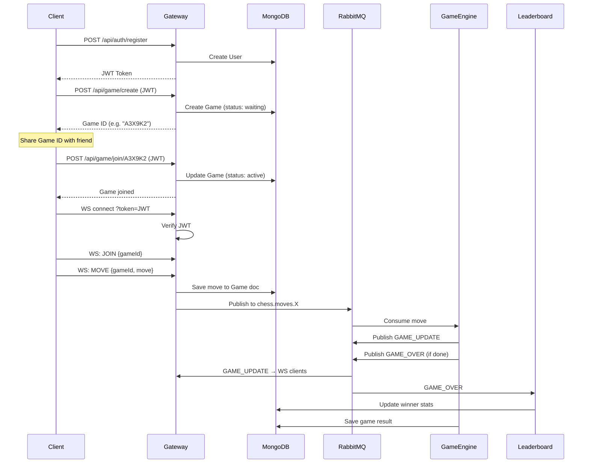

# JWT Auth, MongoDB, Game History & Leaderboard — Implementation Plan

The existing `distributed-chess` project is a Bun-based monorepo with three microservices (gateway, game-engine, leaderboard) communicating via RabbitMQ. Currently there is **no authentication**, **no database**, scores are in-memory, and players are anonymous UUIDs. This plan adds:

1. **JWT-based user authentication** (register/login)
2. **MongoDB** for persistent storage
3. **Game history** — who played, moves, who won
4. **Leaderboard** showing **usernames** (not UUIDs)
5. **Unique game ID** — one user generates it, shares with opponent to join

---

## User Review Required

> [!IMPORTANT]
> **MongoDB connection**: The plan assumes a local MongoDB instance at `mongodb://localhost:27017/chess`. If you're using MongoDB Atlas or a different URI, please let me know so I can adjust the `.env` config.

> [!IMPORTANT]
> **No password hashing library choice**: I'll use `bcryptjs` (pure JS, no native deps) for password hashing. If you prefer `argon2` or another library, let me know.

> [!WARNING]
> **Breaking change to WebSocket flow**: Currently, any WebSocket client can join and play as an anonymous UUID. After this change, clients must first call the REST API to register/login, obtain a JWT token, and pass it as a query parameter when connecting via WebSocket (`ws://localhost:3000?token=<JWT>`). The WebSocket handler will verify the token and associate the connection with the authenticated user.

---

## Proposed Changes

### Shared Package

#### [NEW] [db.ts](file:///d:/coding/development/Web%20Development/100x/100xBackendProject/12.chess-engine/distributed-chess/shared/db.ts)
- Mongoose connection helper (`connectDB()`) used by all services
- Connection URI from `process.env.MONGODB_URI` with fallback to `mongodb://localhost:27017/chess`

#### [NEW] [models/User.ts](file:///d:/coding/development/Web%20Development/100x/100xBackendProject/12.chess-engine/distributed-chess/shared/models/User.ts)
- Mongoose schema: `username` (unique), `email` (unique), `password` (hashed)
- Timestamps enabled

#### [NEW] [models/Game.ts](file:///d:/coding/development/Web%20Development/100x/100xBackendProject/12.chess-engine/distributed-chess/shared/models/Game.ts)
- Mongoose schema:
  - `gameId` (string, unique) — the shareable unique game code
  - `whitePlayer` / `blackPlayer` (ref to User `_id`, or username string)
  - `moves` — array of `{ from, to, player, timestamp }`
  - `status` — `"waiting"` | `"active"` | `"completed"`
  - `winner` — username of the winner (or `"draw"` / `null`)
  - `finalFen` — the final board state
  - Timestamps

#### [MODIFY] [types.ts](file:///d:/coding/development/Web%20Development/100x/100xBackendProject/12.chess-engine/distributed-chess/shared/types.ts)
- Add `GameOverEvent` type with `gameId`, `winner` (username), `loser` (username)
- Expand `MoveEvent` to include `username`

#### [MODIFY] [package.json](file:///d:/coding/development/Web%20Development/100x/100xBackendProject/12.chess-engine/distributed-chess/shared/package.json)
- Add exports for `./db`, `./models/User`, `./models/Game`

---

### Gateway Service

#### [NEW] [src/middleware/auth.ts](file:///d:/coding/development/Web%20Development/100x/100xBackendProject/12.chess-engine/distributed-chess/services/gateway/src/middleware/auth.ts)
- JWT verification middleware for Express routes
- Extracts user from `Authorization: Bearer <token>` header
- Attaches `req.user = { userId, username }` to the request

#### [NEW] [src/routes/auth.ts](file:///d:/coding/development/Web%20Development/100x/100xBackendProject/12.chess-engine/distributed-chess/services/gateway/src/routes/auth.ts)
- `POST /api/auth/register` — creates user with hashed password, returns JWT
- `POST /api/auth/login` — verifies credentials, returns JWT
- `GET /api/auth/me` — returns current user profile (protected)

#### [NEW] [src/routes/game.ts](file:///d:/coding/development/Web%20Development/100x/100xBackendProject/12.chess-engine/distributed-chess/services/gateway/src/routes/game.ts)
- `POST /api/game/create` — (protected) generates a unique 6-char game ID, creates a `Game` doc with status `"waiting"`, returns the game ID for sharing
- `POST /api/game/join/:gameId` — (protected) second player joins, game status → `"active"`
- `GET /api/game/history` — (protected) returns current user's game history
- `GET /api/game/:gameId` — (protected) returns game details

#### [NEW] [src/routes/leaderboard.ts](file:///d:/coding/development/Web%20Development/100x/100xBackendProject/12.chess-engine/distributed-chess/services/gateway/src/routes/leaderboard.ts)
- `GET /api/leaderboard` — public endpoint, returns top players with **usernames** and win counts from MongoDB

#### [MODIFY] [src/server.ts](file:///d:/coding/development/Web%20Development/100x/100xBackendProject/12.chess-engine/distributed-chess/services/gateway/src/server.ts)
- Add `express.json()` middleware
- Connect to MongoDB on startup via `connectDB()`
- Mount auth, game, and leaderboard routes
- Add `.env` loading for `JWT_SECRET`, `MONGODB_URI`

#### [MODIFY] [src/ws.ts](file:///d:/coding/development/Web%20Development/100x/100xBackendProject/12.chess-engine/distributed-chess/services/gateway/src/ws.ts)
- On connection: extract `token` from URL query params, verify JWT
- Reject unauthenticated connections
- Use `username` from JWT payload instead of random UUID
- On `JOIN`: validate that the game exists in MongoDB and user is a participant
- On `MOVE`: include `username` in the move event published to RabbitMQ
- Store moves in the Game document in MongoDB

#### [MODIFY] [package.json](file:///d:/coding/development/Web%20Development/100x/100xBackendProject/12.chess-engine/distributed-chess/services/gateway/package.json)
- Add dependencies: `mongoose`, `jsonwebtoken`, `bcryptjs`, `@types/jsonwebtoken`, `@types/bcryptjs`

---

### Game Engine Service

#### [MODIFY] [src/consumer.ts](file:///d:/coding/development/Web%20Development/100x/100xBackendProject/12.chess-engine/distributed-chess/services/game-engine/src/consumer.ts)
- Connect to MongoDB on startup
- On `GAME_OVER` event: update the Game document with `winner`, `finalFen`, `status: "completed"`
- Include `whitePlayer`/`blackPlayer` usernames in the `GAME_OVER` event published to RabbitMQ

#### [MODIFY] [src/engine.ts](file:///d:/coding/development/Web%20Development/100x/100xBackendProject/12.chess-engine/distributed-chess/services/game-engine/src/engine.ts)
- Return player usernames alongside winner color so that the consumer can publish username-based winner info

#### [MODIFY] [package.json](file:///d:/coding/development/Web%20Development/100x/100xBackendProject/12.chess-engine/distributed-chess/services/game-engine/package.json)
- Add dependency: `mongoose`

---

### Leaderboard Service

#### [MODIFY] [src/consumer.ts](file:///d:/coding/development/Web%20Development/100x/100xBackendProject/12.chess-engine/distributed-chess/services/leaderboard/src/consumer.ts)
- Connect to MongoDB on startup
- On `GAME_OVER`: update `User` document to increment win count (or a separate leaderboard collection)

#### [MODIFY] [src/leaderboard.ts](file:///d:/coding/development/Web%20Development/100x/100xBackendProject/12.chess-engine/distributed-chess/services/leaderboard/src/leaderboard.ts)
- Replace in-memory `Map` with MongoDB queries
- `updateScore()` → increment wins for winner username in User doc
- `getScores()` → query Users sorted by wins descending

#### [MODIFY] [package.json](file:///d:/coding/development/Web%20Development/100x/100xBackendProject/12.chess-engine/distributed-chess/services/leaderboard/package.json)
- Add dependency: `mongoose`

---

### Root Level

#### [NEW] [.env](file:///d:/coding/development/Web%20Development/100x/100xBackendProject/12.chess-engine/distributed-chess/.env)
- `JWT_SECRET=your-super-secret-key-change-in-production`
- `MONGODB_URI=mongodb://localhost:27017/chess`

#### [MODIFY] [docker-compose.yml](file:///d:/coding/development/Web%20Development/100x/100xBackendProject/12.chess-engine/distributed-chess/docker-compose.yml)
- Add MongoDB service alongside RabbitMQ

#### [MODIFY] [.gitignore](file:///d:/coding/development/Web%20Development/100x/100xBackendProject/12.chess-engine/distributed-chess/.gitignore)
- Add `.env` if not already present

---

## Architecture Flow (After Changes)

---

## Open Questions

> [!IMPORTANT]
> 1. **MongoDB**: Are you running MongoDB locally, or do you want me to add it to `docker-compose.yml`? I'll add it to docker-compose by default.
> 2. **Game ID format**: I plan to use a random 6-character alphanumeric code (e.g., `A3X9K2`). Is that acceptable, or do you want a different format?
> 3. **Leaderboard scope**: Should the leaderboard show **total wins** only, or also **total games played, win rate**, etc.?

---

## Verification Plan

### Automated Tests
1. Start MongoDB and RabbitMQ via `docker-compose up -d`
2. Run `bun install` to install new dependencies
3. Start all services and test the following API calls using `curl`:
   - Register a user → expect JWT
   - Login → expect JWT
   - Create game → expect game ID
   - Join game with second user → expect success
   - Connect via WebSocket with JWT → expect connection accepted
   - Connect via WebSocket without JWT → expect rejection

### Manual Verification
- Verify game history is persisted in MongoDB after a game completes
- Verify leaderboard shows usernames and correct win counts
- Verify two users can share a game ID and play against each other
